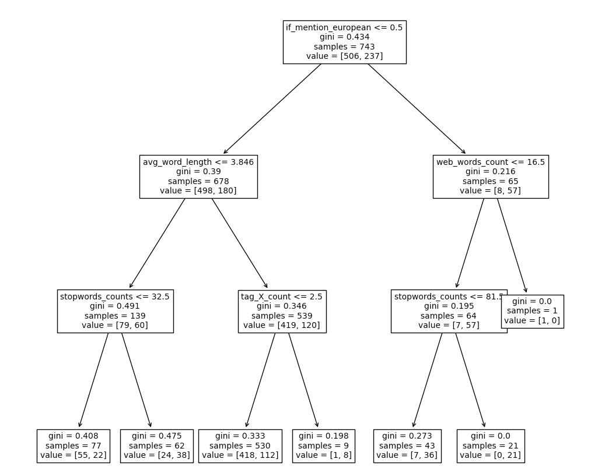
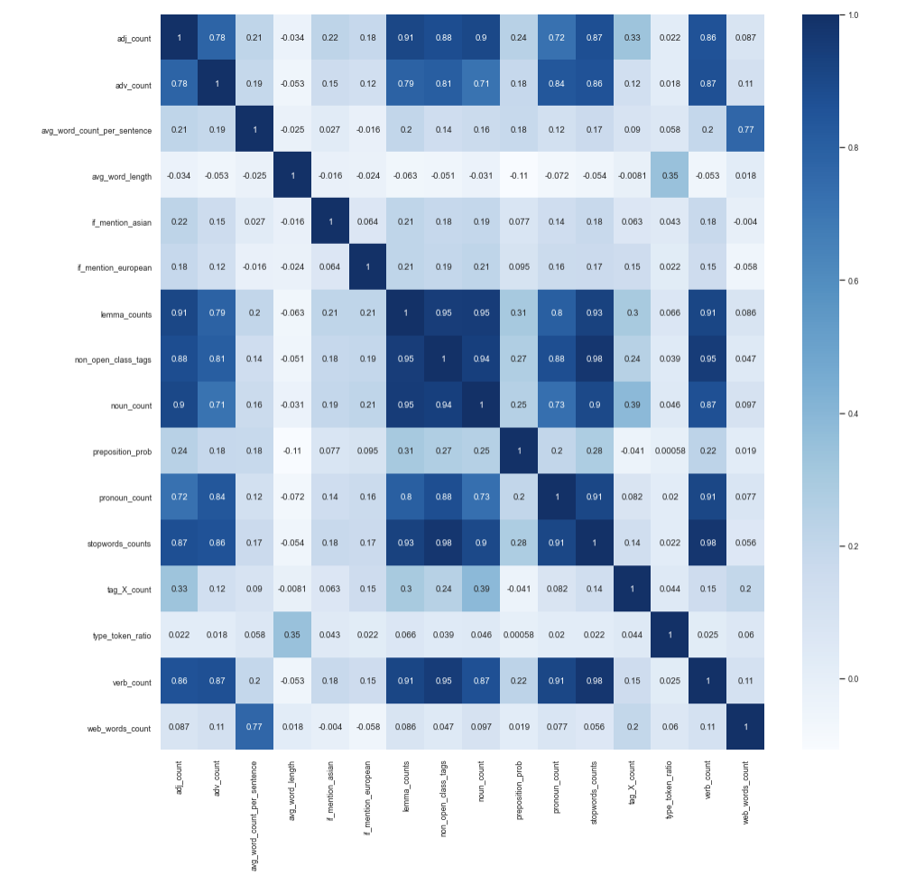

# NLP Native Language Classification System
Given the HTML documents scrapped from [Lang-8 language learning website](https://lang-8.com/), using computational linguistics knowledge to extract features and build an end-to-end classification system to distinguish English text written by Lang-8 users whose native language(L1) is another European language (French and Spanish) from those written by L1 speakers of East Asian languages(Japanese, Korean, and Mandarin Chinese).

## Summary of Features

* We created `if_mention_asian()` and `if_mention_european()` boolean features based on lexicons to check if the text mentions asian languages or countries and european languages or countries being mentioned in the text. We added these two features because given the nature of lang8 website, we thought that the users would introduce their countries and/or languages in the forum.  [satisfy the binary and lexicon requirement]
* We counted the number of English stopwords in the html text with `stopwords_counts()` feature. We predicted that it would be meaningful to see the comparisons of the usage of this feature by asian and european languages speakers. [satisfy the statistics requirement]

* We created `get_length_in_words()`, `get_avg_word_per_sentence()`, and `get_avg_word_length()` features to get the overall understanding of length of the text in words, average word length, and average count of words per sentence. We thought that European learners have larger vocabulary and are more likely to use long sentences than Asian learners . Therefore, they would have higher numbers in these three features than Asian learners. For the same reason we also counted the number of lemmatized words with `lemma_counts()`. [The `get_avg_word_per_sentence()` should satisfy the sentence segmentation requirement and `lemma_count()` should satisfy the lemmatization requirement]
* We created the `type_token_ratio()` feature to see the lexical richness of the text written by European vs. Asian learners. We expect that the lexical richness from European learners is higher than Asian learners because European words or pronunciations are closer to English which result in a larger vocabulary for them.  [satisfy the statistics requirement]
* We created the `get_pos_elements()` function that includes features such as counts the number of nouns, verbs, adjectives, adverbs, and pronouns used by the learners. We thought that maybe either the European or the Asian learners would use more of these elements than others. [satisfy part-of-speech tagging requirement]
* In addition to that, we also included the  `get_preposition_proba()` because in our group, when we learnt english, we often forget about the prepositions, such as “I talked to him” which should be “I talked to him”. That is why we think it would make sense if we include this feature in the model. [satisfy part-of-speech tagging requirement]

* Furthermore, we added `count_X_tags()`  feature to count the number of X pos tags from a given text and the `count_non_open_class_tags()` feature to count the number of non open class tags from a given text. We thought that in a language learning forum like this, the learners would be less likely to use words that are tagged as “X” and/or use non-open class tags. We are expecting to see a difference in these two features across European and Asian learners. [satisfy part-of-speech tagging requirement]
* Most importantly, we added `count_web_text()` to see if any of the words used in lang8 matched the webtext corpus. Since lang8 is an online forum, we thought it is more likely that there is a match. Additionally, based on different cultures, European learners probably are more likely to use english web words than Asian learners because the culture shares the same root of language. [satisfy the statistics requirement]

 

## Feature Performances

Based on the correlation matrix of features, we are surprised that lemm_counts and Type-token ratio are dropped by the ablation algorithm because it indicates the lexical richness between groups. However, an important thing to point out is that some of the features are highly correlated with each other. For instance, `adj_count` is highly correlated with `lemma_counts` `noun_count`, and `non_open_class_tags`. The correlation between features can also be seen in the ablation process. During the process, when a feature that is highly correlated is removed, the score stays the same. At the end of ablation, the features that are kept are `avg_word_length`, `if_mention_european`, `stopwords_counts`, `tag_X_count`, and `web_words_count`. The features that are kept are reasonable and make sense because these features can be a good indicator of how the Asian and European learners differ. Based on the plotted tree, the most important features are `if_mentiond_european`, followed by `avg_word_length` and `web_words_count`.
